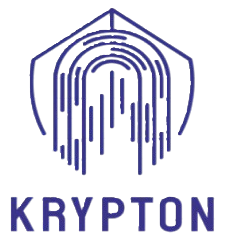

<p align="center">
  
</p>

<h1 align="center">Krypton</h1>

<p align="center">
  <strong>Gerenciador de senhas seguro e offline</strong><br>
  Desenvolvido com Flutter · Criptografia AES-256-GCM · Banco de dados SQLCipher · Autenticação biométrica
</p>

<p align="center">
  
  
  
  
</p>

---

## 📋 Sobre o Projeto

O **Krypton** é um aplicativo mobile de gerenciamento de senhas que armazena todas as credenciais **localmente** no dispositivo do usuário, sem depender de servidores externos ou nuvem. Todas as senhas são criptografadas com **AES-256-GCM** antes de serem persistidas em um banco de dados **SQLite criptografado com SQLCipher**, garantindo segurança de ponta a ponta mesmo em caso de acesso físico ao dispositivo.

---

## ✨ Funcionalidades

| Funcionalidade | Descrição |
|---|---|
| 🔐 **Autenticação dupla** | Login via **senha mestre (PIN)** ou **biometria** (impressão digital / reconhecimento facial) |
| 🔑 **Gerador de senhas** | Gerador configurável com opções de comprimento, letras maiúsculas/minúsculas, números e caracteres especiais |
| 📂 **Categorias** | Organização por categorias: *Redes Sociais*, *Bancos*, *Trabalhos* e *Outros* |
| ⭐ **Favoritos** | Marque senhas como favoritas para acesso rápido |
| 🔍 **Busca** | Busca por título ou nome de usuário em tempo real |
| 📋 **CRUD completo** | Criar, visualizar, editar e excluir senhas salvas |
| 🖼️ **Imagem personalizada** | Associe uma imagem customizada a cada credencial |
| 🤖 **Autofill nativo (Android)** | Serviço de autopreenchimento integrado ao sistema Android, preenchendo senhas em outros apps e navegadores |
| ⚙️ **Configurações** | Tela de configurações para ativar/desativar o serviço de autofill do sistema |
| 🔒 **100% Offline** | Nenhum dado sai do dispositivo — armazenamento totalmente local |

---

## 🏗️ Arquitetura de Segurança

O Krypton implementa uma arquitetura criptográfica em múltiplas camadas:

```
┌──────────────────────────────────────────────────────────────┐
│                     CAMADA DE ACESSO                         │
│  Biometria (local_auth)  OU  Senha Mestre / Chave Recup.    │
└──────────────┬────────────────────────┬──────────────────────┘
               │                        │
               ▼                        ▼
┌──────────────────────┐  ┌────────────────────────────────────┐
│   Android Keystore   │  │        Argon2id (KDF)              │
│  (flutter_secure_    │  │  memory=16MB, iterations=2         │
│   storage)           │  │  salt independente por blob        │
│                      │  │                                    │
│  Armazena DB_Key     │  │  Deriva K1 (senha mestre)          │
│  em texto (b64url)   │  │  Deriva K2 (chave recuperação)     │
└──────────┬───────────┘  └──────────┬─────────────────────────┘
           │                         │
           │    ┌────────────────────┘
           │    │  AES-256-GCM decrypt
           │    │  blob1 → DB_Key  (via K1)
           │    │  blob2 → DB_Key  (via K2, fallback)
           ▼    ▼
┌──────────────────────────────────────────────────────────────┐
│                      DB_KEY (256 bits)                        │
│           Chave mestra do banco de dados                     │
└──────────────────────────┬───────────────────────────────────┘
                           │
                           ▼
┌──────────────────────────────────────────────────────────────┐
│                SQLite + SQLCipher (Drift)                     │
│          PRAGMA key = "x'<DB_KEY em hex>';"                  │
│                                                              │
│  ┌─────────────┐    ┌──────────────────────────────────────┐ │
│  │   users     │    │              senhas                  │ │
│  │  id, nome   │    │  id, userID, titulo, usuario,        │ │
│  └─────────────┘    │  cipherText, authTag, IV, tipo,      │ │
│                     │  url, favorito, imagemPath            │ │
│                     └──────────────────────────────────────┘ │
└──────────────────────────────────────────────────────────────┘
                           │
                  AES-256-GCM por registro
                           │
                           ▼
              Senha em texto plano (em memória apenas)
```

### Fluxo de Criptografia

1. **Cadastro**: Uma `DB_Key` de 256 bits é gerada aleatoriamente e armazenada no **Android Keystore** via `flutter_secure_storage`. Dois "blobs" criptografados (via **AES-256-GCM**) são gerados — um protegido pela **senha mestre** (derivada com Argon2id) e outro pela **chave de recuperação** — e persistidos no `SharedPreferences`.

2. **Login por biometria**: A biometria desbloqueia o Keystore do Android, de onde a `DB_Key` é lida diretamente.

3. **Login por senha**: A senha digitada é derivada com **Argon2id** para produzir a chave que descriptografa o `blob1`. Se falhar (senha errada), tenta o `blob2` (chave de recuperação).

4. **Armazenamento de senhas**: Cada senha individual é criptografada com **AES-256-GCM** usando a `DB_Key`, com um **IV (nonce) único de 12 bytes** por registro. O `cipherText`, `authTag` e `IV` são armazenados separadamente no banco.

---

## 🛠️ Stack Tecnológica

| Camada | Tecnologia | Propósito |
|---|---|---|
| **Framework** | Flutter 3.11+ / Dart | Interface multiplataforma |
| **Banco de dados** | Drift + SQLCipher (`sqlite3_flutter_libs`) | Persistência local criptografada |
| **Criptografia** | `cryptography` (AES-256-GCM, Argon2id) | Cifragem de senhas e derivação de chaves |
| **Keystore** | `flutter_secure_storage` | Armazenamento seguro da DB_Key no Keystore do Android |
| **Preferências** | `shared_preferences` | Persistência dos blobs criptografados e salts |
| **Biometria** | `local_auth` | Autenticação por impressão digital / face |
| **Autofill** | MethodChannel nativo | Serviço de autopreenchimento do Android |
| **Utilitários** | `url_launcher`, `image_picker`, `path_provider` | Abertura de URLs, seleção de imagens, caminhos de sistema |

---

## 📁 Estrutura do Projeto

```
lib/
├── main.dart                          # Entry point + tela Home principal
├── images/                            # Assets de imagem (logo)
├── data/
│   ├── models/
│   │   ├── senhas.dart                # Modelo de dados de senha
│   │   └── user.dart                  # Modelo de dados de usuário
│   ├── database/
│   │   ├── app_database.dart          # Configuração do SQLite/SQLCipher com Drift
│   │   └── db.dart                    # Singleton DbService + wrapper RawDb
│   └── DAO/
│       ├── authController.dart        # KeystoreService — login via PIN/biometria
│       ├── senhaController.dart       # CRUD de senhas com criptografia AES-GCM
│       └── userContoller.dart         # Cadastro de usuário + geração de DB_Key
├── services/
│   ├── autofill_bridge.dart           # Bridge Dart ↔ MethodChannel nativo (autofill)
│   ├── biometric_services.dart        # Verificação e autenticação biométrica
│   └── extra_services.dart            # Função de derivação de chaves (Argon2id)
└── views/
    ├── login_view.dart                # Tela de login (PIN + biometria)
    ├── register_view.dart             # Tela de cadastro (nome + senha mestre)
    ├── password_generator_view.dart   # Gerador de senhas configurável
    ├── password_creator_view.dart     # Formulário de criação de nova senha
    ├── ver_senha.dart                 # Visualização detalhada de uma senha
    ├── editar_senha.dart              # Edição de senha existente
    ├── autofill_view.dart             # UI do serviço de autofill
    └── configuracoes_view.dart        # Tela de configurações
```

---

## 🚀 Como Executar

### Pré-requisitos

- [Flutter SDK](https://docs.flutter.dev/get-started/install) ≥ 3.11
- Android SDK com API Level ≥ 21
- Dispositivo Android físico (recomendado para biometria) ou emulador

### Instalação

```bash
# Clone o repositório
git clone https://github.com/JoaoPilger/Krypton.git
cd Krypton

# Instale as dependências
flutter pub get

# Execute no dispositivo/emulador conectado
flutter run
```

### Build de produção

```bash
# APK
flutter build apk --release

# App Bundle (para Google Play)
flutter build appbundle --release
```

---

## 📱 Telas do Aplicativo

| Tela | Descrição |
|---|---|
| **Login** | Autenticação via senha mestre ou biometria |
| **Cadastro** | Registro inicial do usuário com nome e senha mestre |
| **Home** | Lista de senhas com busca, filtros por categoria e favoritos |
| **Gerador de Senhas** | Geração de senhas com opções de comprimento e tipos de caracteres |
| **Nova Senha** | Formulário para salvar uma nova credencial |
| **Visualizar Senha** | Detalhes de uma credencial com opção de copiar, editar e excluir |
| **Editar Senha** | Edição de credenciais existentes |
| **Configurações** | Ativação do serviço de autofill do Android |

---

## 👥 Autores

Projeto desenvolvido como trabalho acadêmico da disciplina **DSDM** — **3ª Fase**.

---

## 📄 Licença

Este projeto é de uso acadêmico. Todos os direitos reservados.
